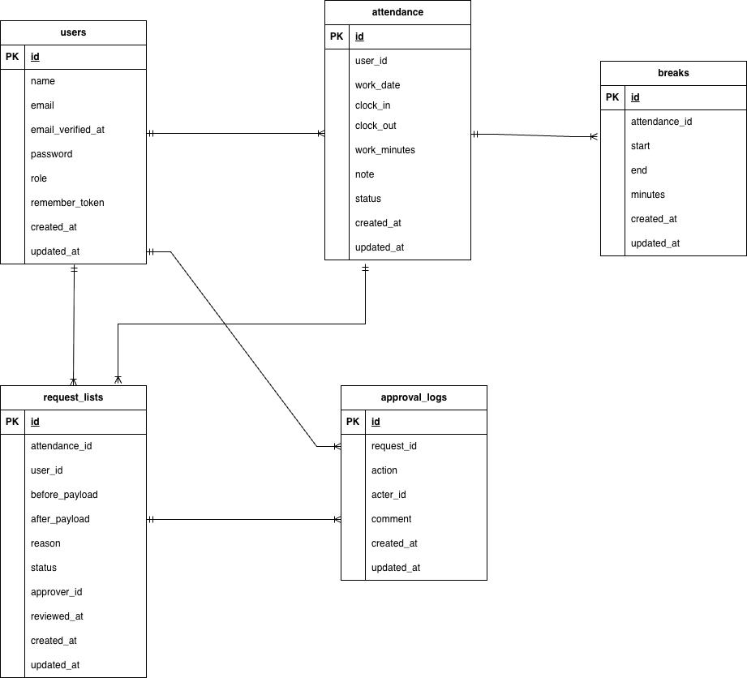

# Attendance Management(勤怠管理アプリ)

## 環境構築

### Docker ビルド
1. `git clone git@github.com:46kuro96/attendance-management.git`
2. DockerDesktopアプリを起動
3. `docker-compose up -d --build`

Mac の M1・M2 チップの PC の場合、`no matching manifest for linux/arm64/v8 in the manifest list entries`のメッセージが表示されビルドができないことがあります。
エラーが発生する場合は、docker-compose.yml ファイルの「mysql」内に「platform」の項目を追加で記載してください。

```bash
mysql:
    platform: linux/x86_64 # ←この1行を追加
    image: mysql:8.0
    environment:
```

### Laravel 環境構築

1. `docker-compose exec php bash`
2. `composer install`
3. .env.example をコピーして .env に変更
4. .env に以下のように編集

```
DB_HOST=mysql
DB_DATABASE=laravel_db
DB_USERNAME=laravel_user
DB_PASSWORD=laravel_pass

MAIL_FROM_ADDRESS=admin@example.com
```

5. `php artisan key:generate`
6. `php artisan migrate`
7. `php artisan db:seed`

## 使用技術

- Mysql 8.0
- PHP 8.2
- Laravel 10
- MailHog
- Laravel Fortify
- PHPUnit

## 認証機能

本プロジェクトでは **Laravel Fortify** を使用して認証機能を構築しています。

**主な機能：**
- 新規会員登録（ユーザー名・メールアドレス・パスワード）
- メール認証（MailHogに送信されたリンクで確認）
- ログイン / ログアウト
- 管理者・一般ユーザーのロール判定（Gateを使用）

**メール確認手順：**
1.	新規登録後、MailHogにメールが届く
2.	http://localhost:8025 にアクセス
3.	メール内の認証リンクをクリックしてログイン完了

## 一般ユーザーのログイン用初期データ

- 名前: TestUser
- メールアドレス: user@example.com
- パスワード: password

## 管理者のログイン用初期データ

- 名前: Admin
- メールアドレス: admin@example.com
- パスワード: password

## PHPUnit(テスト)

本プロジェクトではPHPUnitによる自動テストを導入しています。
**実行コマンド**
```bash
php artisan test --testsuite=Feature
```

## URL

- 環境開発一般ユーザー: http://localhost/login
- 環境開発管理者: http://localhost/admin/login
- phpMyAdmin: http://localhost:8080/
- MailHog(メール確認用): http://localhost:8025

## ER図


